# Bank Transaction Pipeline Architecture

## Overview

This document describes the architecture of the Bank Transaction ETL Pipeline, a production-grade system for processing financial transaction data.

## High-Level Architecture

```
┌─────────────────┐     ┌─────────────┐     ┌─────────────┐     ┌─────────────┐     ┌─────────────┐
│   Raw CSV       │────▶│   Extract   │────▶│  Transform  │────▶│  Reconcile  │────▶│    Load     │
│  (Input Data)   │     │  & Validate │     │  & Enrich   │     │   & Verify  │     │  (Parquet)  │
└─────────────────┘     └─────────────┘     └─────────────┘     └─────────────┘     └──────┬──────┘
                                                                                           │
                                                                                           ▼
                                                                                  ┌─────────────┐
                                                                                  │  Aggregate  │
                                                                                  │(Daily Bal)  │
                                                                                  └─────────────┘
```

## Component Diagram (Mermaid)

```mermaid
flowchart TB
    subgraph Sources["📁 Data Sources"]
        RAW_CSV["transactions_raw.csv<br/>Raw transaction feed"]
    end

    subgraph Config["⚙️ Configuration"]
        YAML["pipeline_config.yaml"]
    end

    subgraph Extract["🔍 Extract (extract.py)"]
        EXT["extract_transactions()"]
        VAL["Schema Validation"]
    end

    subgraph Transform["🔧 Transform (transform.py)"]
        TRANS["transform_transactions()"]
        DATES["Parse Dates"]
        STATUS["Normalize Status"]
        AMT["Normalize Amount"]
        LATE["Detect Late Arrivals"]
    end

    subgraph Quality["📊 Quality (quality.py)"]
        QMETRICS["Quality Metrics"]
        REJECT["Rejection Report"]
    end

    subgraph Reconcile["⚖️ Reconcile (reconcile.py)"]
        RECON["reconcile_raw_vs_ledger()"]
    end

    subgraph Load["💾 Load (load.py)"]
        LD["load_ledger()"]
        LEDGER["ledger_transactions.parquet"]
    end

    subgraph Output["📈 Output"]
        DAILY["daily_account_balance.parquet"]
    end

    subgraph Checkpoint["🔄 Checkpoint (checkpoint.py)"]
        CKPT["PipelineCheckpoint"]
    end

    RAW_CSV --> EXT
    YAML --> EXT
    EXT --> VAL --> TRANS
    TRANS --> DATES --> STATUS --> AMT --> LATE
    LATE --> QMETRICS --> REJECT
    LATE --> RECON --> LD --> LEDGER --> DAILY

    style Sources fill:#fff8e1,stroke:#f57f17
    style Extract fill:#e3f2fd,stroke:#1565c0
    style Transform fill:#e3f2fd,stroke:#1565c0
    style Quality fill:#f3e5f5,stroke:#7b1fa2
    style Reconcile fill:#f3e5f5,stroke:#7b1fa2
    style Load fill:#e8f5e9,stroke:#2e7d32
    style Output fill:#e8f5e9,stroke:#2e7d32
    style Checkpoint fill:#fff3e0,stroke:#ef6c00
```



## Component Details

### 1. Configuration Layer
- **`config/pipeline_config.yaml`**: Central configuration for all pipeline settings
- **`src/config_schema.py`**: Pydantic models for validation
- **`src/config.py`**: Configuration loader

### 2. Extract Layer (`src/extract.py`)
- **Purpose**: Load raw CSV data with validation
- **Key Functions**:
  - `extract_transactions()`: Main extraction function
  - Schema validation (required columns, no duplicates, no nulls)
  - Chunked processing support for large files
  - Transaction type validation

### 3. Transform Layer (`src/transform.py`)
- **Purpose**: Clean and standardize transaction data
- **Key Functions**:
  - `transform_transactions()`: Main transformation function
  - Date parsing (`txn_date`, `ingestion_date`)
  - Status normalization (SUCCESS/FAILED)
  - Amount normalization (refunds made negative)
  - Late arrival detection
- **Outputs**:
  - `transformed_df`: All transactions with audit trail
  - `ledger_df`: SUCCESS transactions only

### 4. Quality Layer (`src/quality.py`)
- **Purpose**: Monitor data quality and generate reports
- **Key Functions**:
  - `calculate_data_quality_metrics()`: Compute quality metrics
  - `export_data_quality_metrics()`: Export to JSON
  - `generate_rejection_report()`: CSV report of failed transactions
- **Outputs**:
  - `data_quality_metrics.json`
  - `rejection_report.csv`

### 5. Reconcile Layer (`src/reconcile.py`)
- **Purpose**: Validate data integrity before persistence
- **Key Functions**:
  - `reconcile_raw_vs_ledger()`: Compare totals by date
  - Configurable tolerance checking
  - Fails pipeline on mismatch

### 6. Load Layer (`src/load.py`)
- **Purpose**: Persist validated data atomically
- **Key Functions**:
  - `load_ledger()`: Write to Parquet with validation
  - Atomic write (temp file + rename)
  - Validates `txn_id` uniqueness and non-null
- **Output**:
  - `ledger_transactions.parquet`

### 7. Checkpoint Layer (`src/checkpoint.py`)
- **Purpose**: Fault tolerance and resume capability
- **Key Functions**:
  - `PipelineCheckpoint`: Manager class
  - `save_checkpoint()`: Save state at each step
  - `load_checkpoint()`: Resume from last step
  - `clear_checkpoint()`: Cleanup on success

### 8. Orchestrator (`src/pipeline.py`)
- **Purpose**: Main entry point and workflow coordination
- **Key Functions**:
  - `run_pipeline()`: Execute full ETL workflow
  - Checkpoint management
  - Daily balance aggregation
  - Error handling and logging

## Data Flow

1. **Input**: Raw CSV with transaction data
2. **Extract**: Load and validate schema
3. **Checkpoint**: Save extract state
4. **Transform**: Clean and normalize
5. **Checkpoint**: Save transform state
6. **Quality**: Calculate metrics and generate reports
7. **Reconcile**: Validate totals match
8. **Checkpoint**: Save reconcile state
9. **Load**: Persist to Parquet
10. **Checkpoint**: Save load state
11. **Aggregate**: Generate daily balances
12. **Checkpoint**: Clear on success

## Output Files

| File | Description |
|------|-------------|
| `data/processed/ledger_transactions.parquet` | Standardized transaction ledger |
| `data/processed/daily_account_balance.parquet` | Daily account aggregations |
| `data/processed/data_quality_metrics.json` | Quality metrics |
| `data/processed/rejection_report.csv` | Rejected transaction details |
| `data/checkpoints/` | Pipeline state for resume |

## Configuration Schema

```yaml
pipeline:
  name: bank_transaction_pipeline
  environment: local

paths:
  raw_transactions: data/raw/transactions_raw.csv
  ledger_output: data/processed/ledger_transactions.parquet
  daily_balance_output: data/processed/daily_account_balance.parquet

business_rules:
  success_statuses: [COMPLETED, SETTLED, OK]
  refund_types: [REFUND]
  valid_txn_types: [CARD, CASH, REFUND, DEBIT, CREDIT, ...]
  late_arrival_days_threshold: 0

reconciliation:
  tolerance_amount: 0.00
  fail_on_mismatch: true

processing:
  chunksize: null  # Set for large files
```

## Key Design Principles

1. **Configuration-driven**: All business rules in YAML
2. **Fail-fast validation**: Strict quality checks
3. **Ledger-first**: Accounting-ready outputs
4. **Idempotent**: Safe to re-run
5. **Fault-tolerant**: Checkpoint/resume capability
6. **Observable**: Comprehensive metrics and logging

## Viewing the Diagram

### Option 1: Markdown Viewer (GitHub)
The Mermaid diagram above renders directly in GitHub markdown.

### Option 2: HTML Viewer
Open `architecture_diagram.html` in a browser for an interactive view.

### Option 3: Mermaid Live Editor
Copy the contents of `architecture_diagram.mmd` to [Mermaid Live Editor](https://mermaid.live)

### Option 4: VS Code
Install the "Markdown Preview Mermaid Support" extension to view diagrams in VS Code.
